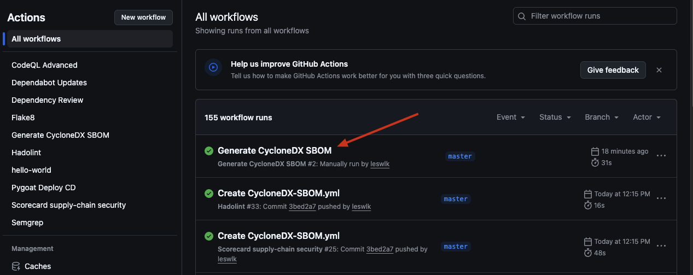
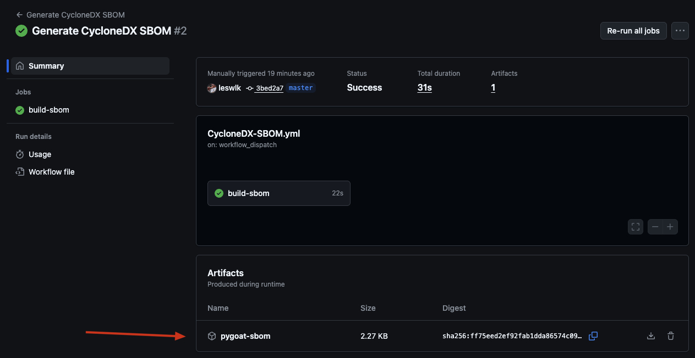
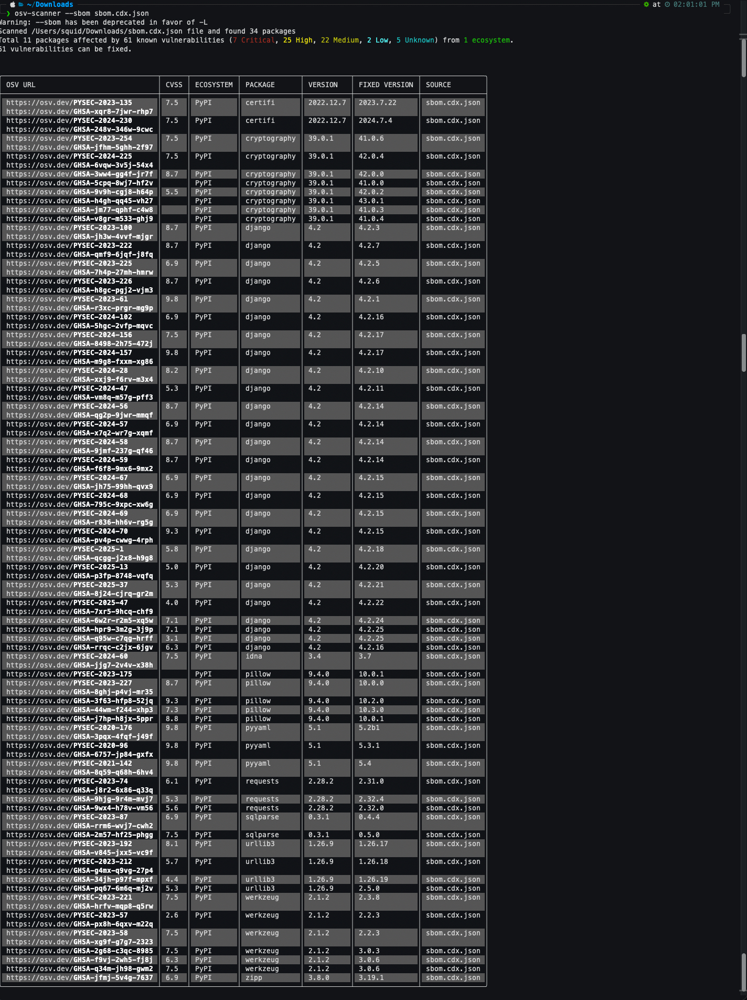

# PyGoat-SBOM

As an addendum to the [PyGoat DevSecOps](https://github.com/leswlk/pygoat-github-actions)
project I've built, I created a workflow to generate an SBOM utilizing CycloneDX. Using OSV-Scanner, I can explore the vulnerabilities if needed.

## Tools used

 - Git CLI 
 - OSV-Scanner

## What is an SBOM?

An SBOM, or Software Bill of Materials, is a formal inventory of all the software components and their supply chain relationships used to build a piece of software. It could be thought of as an "ingredients list" of everything that's included on a food product, but in the case of software everything that's included would be vital components like libraries, versions, and licenses.

This is crucially important because this helps you know exactly what's inside your software, enables finding/fixing vulnerabilities faster, and meeting compliance requirements.

## Who should care about SBOMs in an organization?

Depending on the role/team within an organization, SBOMs has information for everyone.

### Developers
 - Provides easy visibility into included components
 - Dependency clarity to avoid bloat
 - Faster remediation when vulnerabilities occur
### Auditors
 - Traceability of components
 - Evidence of due diligence(helpful for compliance recertifications)
 - Verifiable documentation for builds
### Security Teams
 - Identify vulnerable libraries early
 - Verify license/compliance risks
 - Enforce policy on disallowed components
### Regulators
 - Compliance with EO 14028, NIST 800-218
 - Software transparency in procurement
 - Reduced risk in critical infrastructure

## Instructions

### Create CycloneDX Workflow
 - Create the workflow within GitHub Actions and run it:
 
```
# .github/workflows/CycloneDX-SBOM.yml
name: Generate CycloneDX SBOM

on:
  push:
    branches: [ master ]
  workflow_dispatch:

jobs:
  build-sbom:
    runs-on: ubuntu-latest

    # Needed for GitHub’s dependency-submission API later
    permissions:
      contents: read
      id-token: write

    steps:
      # Grab the code
      - name: Checkout code
        uses: actions/checkout@v4

      # Set up Python the same way PyGoat runs
      - name: Set up Python
        uses: actions/setup-python@v5
        with:
          python-version: '3.11'          # match runtime
          cache: pip

      # Install project deps & the OWASP SBOM generator
      - name: Install dependencies
        run: |
          pip install -r requirements.txt
          pip install cyclonedx-bom            # OWASP-maintained CLI  [oai_citation:0‡PyPI](https://pypi.org/project/cyclonedx-bom/)

      # Build the CycloneDX SBOM (JSON)
      - name: Generate SBOM
        run: |
          cyclonedx-py requirements --output-file sbom.cdx.json

      # -------------- STORAGE / DISTRIBUTION OPTIONS --------------

      # Give engineers something to download
      - name: Upload as workflow artifact
        uses: actions/upload-artifact@v4
        with:
          name: pygoat-sbom
          path: sbom.cdx.json
          retention-days: 30      # tunable
```
The workflow automatically generates a SBOM everytime code is pushed to the master branch. Every build includes a up-to-date CycloneDX SBOM file to provide visibility into all python dependencies, versions, and potential supply chain risks.



### Download SBOM



### View and investigate vulnerabilities with OSV-Scanner

- Open a terminal/command prompt and run OSV-Scanner and explore the vulnerabilities




